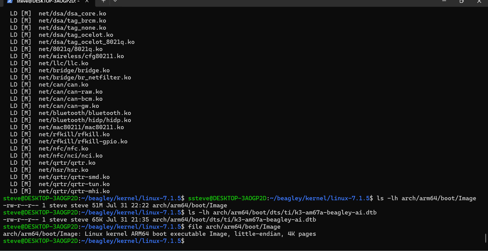
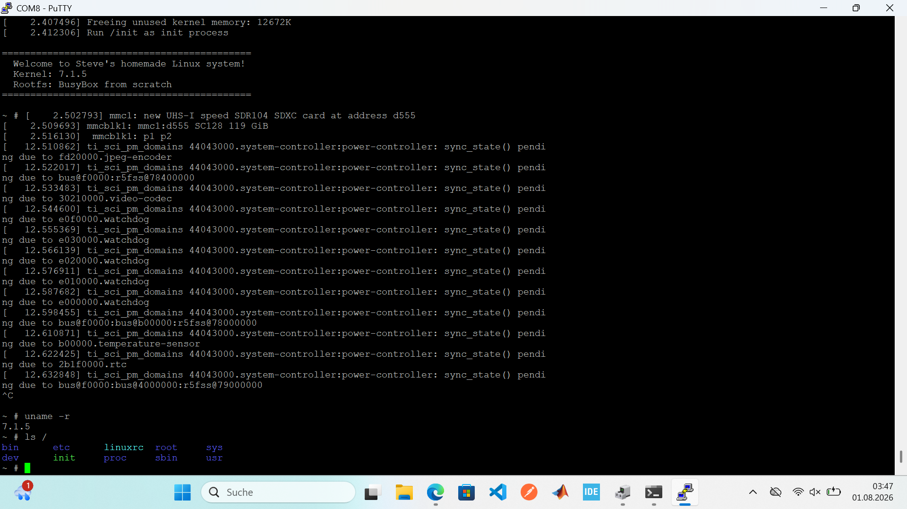
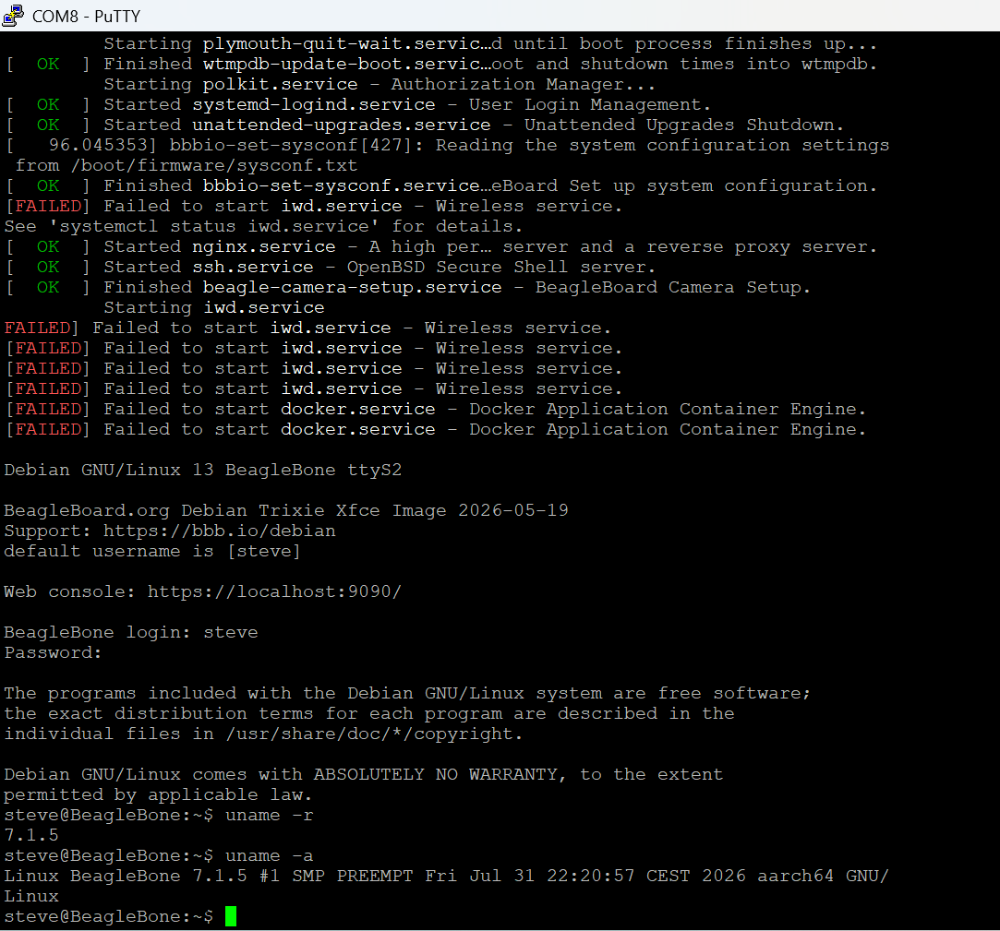

# 🐧 beagley-linux — Embedded Linux From Scratch

> Build a complete Linux system **from scratch** for a BeagleY-AI board: cross-compile the mainline kernel, bring it to boot, debug missing drivers, then assemble a minimal BusyBox rootfs with a custom `/init`.
>
> A learning project that walks through the **entire embedded stack** — from electricity to shell.


-green)


---

## 📋 Table of Contents

- [Hardware](#-hardware)
- [Boot stack overview](#-boot-stack-overview)
- [What was accomplished](#-what-was-accomplished)
- [Step 1 — Cross-compilation toolchain](#step-1--cross-compilation-toolchain)
- [Step 2 — Building the mainline kernel](#step-2--building-the-mainline-kernel)
- [Step 3 — First boot of the custom kernel](#step-3--first-boot-of-the-custom-kernel)
- [Step 4 — Deep debugging](#step-4--deep-debugging)
- [Step 5 — BusyBox rootfs from scratch](#step-5--busybox-rootfs-from-scratch)
- [Step 6 — Controlling hardware: from sysfs to a C app](#step-6--controlling-hardware-from-sysfs-to-a-c-app)
- [Bug log](#-bug-log-encountered--solved)
- [What's left to do](#-whats-left-to-do)
- [Key lessons learned](#-key-lessons-learned)
- [Reference commands](#-reference-commands)

---

## 🔧 Hardware

| Item | Detail |
|---|---|
| **Board** | BeagleY-AI |
| **SoC** | Texas Instruments AM67A (aka J722S / TDA4AEN) |
| **CPU** | 4× ARM Cortex-A53 @ 1.4 GHz + Cortex-R5F + 2× C7x DSP |
| **RAM** | 4 GB (2 banks: `0x80000000` and `0x880000000`) |
| **Storage** | 128 GB microSD card (no eMMC on this board) |
| **Debug console** | UART via Raspberry Pi Debug Probe (3-pin JST connector, 3.3 V) |
| **Serial speed** | 115200 baud, 8N1 |
| **Dev machine** | Windows + WSL2 (Ubuntu 24.04) |

---

## 🗺️ Boot stack overview

The TI AM67A SoC has a multi-stage, TI-specific boot sequence:

```
BootROM (burned into the SoC, immutable)
   │  looks at the SD card
   ▼
tiboot3.bin      ← stage 1: R5 firmware + TI-FS (security)
   ▼
tispl.bin        ← stage 2: U-Boot SPL + TI Device Manager
   ▼
u-boot.img       ← stage 3: the "real" U-Boot (=> prompt)
   ▼
Image + .dtb     ← THE self-built kernel + its device tree
   ▼
/init            ← our BusyBox rootfs takes over
   ▼
/bin/sh          ← interactive shell (PID 1)
```

> The 3 TI binaries (`tiboot3`, `tispl`, `u-boot.img`) are reused as-is.
> **Everything else** (kernel, device tree, rootfs, init) is built in this project.

---

## ✅ What was accomplished

- [x] Set up the serial console (Debug Probe + PuTTY on COM4)
- [x] Explored and fully understood U-Boot (`printenv`, `bdinfo`, `mmc`, `ls`)
- [x] Installed an ARM64 cross-compilation toolchain in WSL2
- [x] Cross-compiled the **mainline 7.1.5 kernel** for the board
- [x] Compiled the `k3-am67a-beagley-ai.dtb` device tree
- [x] **Booted the custom kernel** to a working Debian login
- [x] Deep-debugged two failures (WiFi + Docker) down to root cause
- [x] Deployed kernel modules (`make modules_install`)
- [x] Cross-compiled **BusyBox 1.38.0** as a static binary
- [x] Assembled a **rootfs from scratch** by hand
- [x] Wrote a **custom `/init`** (PID 1)
- [x] Packaged and booted an **initramfs** → full working system 🎉
- [x] Controlled a real LED from userspace (`/sys/class/leds/`)
- [x] Wrote, cross-compiled and shipped a **C app** (SOS Morse) inside the rootfs

---

## Step 1 — Cross-compilation toolchain

We compile **on** an x86 PC (WSL2) **for** an ARM64 target. This is *cross-compilation*.

```bash
sudo apt update
sudo apt install -y gcc-aarch64-linux-gnu build-essential bison flex \
                    libssl-dev bc libncurses-dev wget xz-utils

# Verify
aarch64-linux-gnu-gcc --version
# → aarch64-linux-gnu-gcc (Ubuntu 13.3.0) 13.3.0
```

**Two key variables** appear in every `make` throughout the project:

| Variable | Role |
|---|---|
| `ARCH=arm64` | Compile for the ARM64 architecture |
| `CROSS_COMPILE=aarch64-linux-gnu-` | Prefix of the cross-compiler to use |

---

## Step 2 — Building the mainline kernel

```bash
# Kernel sources
mkdir -p ~/beagley/kernel && cd ~/beagley/kernel
wget https://cdn.kernel.org/pub/linux/kernel/v7.x/linux-7.1.5.tar.xz
tar xf linux-7.1.5.tar.xz
cd linux-7.1.5

# Default ARM64 configuration
make ARCH=arm64 CROSS_COMPILE=aarch64-linux-gnu- defconfig

# Verify board support (all should be =y)
grep "CONFIG_ARCH_K3" .config              # → =y   (TI K3 SoC)
grep "CONFIG_SERIAL_8250_OMAP" .config      # → =y   (serial console)
grep "CONFIG_MMC_SDHCI_AM654" .config       # → =y   (SD card)

# Build (8 cores): kernel + device trees + modules
make -j8 ARCH=arm64 CROSS_COMPILE=aarch64-linux-gnu- Image dtbs modules
```

**Artifacts produced:**

| File | Path | Size |
|---|---|---|
| Kernel | `arch/arm64/boot/Image` | 51 MB |
| Device tree | `arch/arm64/boot/dts/ti/k3-am67a-beagley-ai.dtb` | 65 KB |


*Modules compiling, then verification: `Image` (51 MB), the `k3-am67a-beagley-ai.dtb` device tree (65 KB), and `file` confirming a `Linux kernel ARM64 boot executable`.*

> ⚠️ **Design choice: pure mainline kernel** (instead of the TI vendor fork).
> Accepted trade-off: partial hardware support (WiFi not working — see debugging).

---

## Step 3 — First boot of the custom kernel

**Reversible** method: drop the kernel next to the original files (`-mine` suffix) and boot manually from U-Boot, overwriting nothing.

```bash
# On the board: copy to the boot partition
sudo cp ~/Image /boot/firmware/Image-mine
sudo cp ~/k3-am67a-beagley-ai.dtb /boot/firmware/ti/k3-am67a-beagley-ai-mine.dtb
```

**Manual boot sequence** (U-Boot `=>` prompt):

```
mmc dev 1
load mmc 1:1 0x82000000 /Image-mine
load mmc 1:1 0x88000000 /ti/k3-am67a-beagley-ai-mine.dtb
setenv bootargs console=ttyS2,115200n8 root=/dev/mmcblk1p2 rw rootwait
booti 0x82000000 - 0x88000000
```

✅ **Result: boot up to `BeagleBone login:`** — the custom kernel mounts the existing Debian rootfs and starts the system.

Check:
```bash
uname -r    # → 7.1.5   (not the original 7.0.9)
```


*The `uname -a` output shows the self-compiled 7.1.5 kernel running on aarch64. The build timestamp (`Fri Jul 31 22:20:57 CEST 2026`) confirms it's freshly built — not the vendor kernel.*

---

## Step 4 — Deep debugging

Two services failed at boot (`iwd` = WiFi, `docker`). Investigation method: **funnel** from symptom to root cause.


*The two `[FAILED]` services caught at boot — the starting point of the investigation.*

```
systemctl status  →  ip link / journalctl  →  dmesg  →  .config / device tree
```

### 🔴 WiFi (`iwd.service`) — a 3-layer investigation

| Step | Finding |
|---|---|
| `systemctl status iwd` | Service crash-loops |
| `ip link` | No `wlan0` interface |
| `dmesg \| grep wl18` | **Total silence** — kernel never mentions the chip |
| `.config` | `CONFIG_WL18XX=m` → a driver is present but **as a module** |
| `/lib/modules/` | ❌ `7.1.5/` missing → modules never deployed |
| **Layer 1 fixed** | Deployed modules → `wl18xx` loads, firmware present, **but still no `wlan0`** |
| **Layer 2 found** | The mainline device tree doesn't declare the chip (`wlcore@2` missing under `mmc@fa20000`) |
| **Layer 3 — the real cause** | The vendor DT declares the chip as `compatible = "ti,cc3300"` — a **CC33xx**, not a wl18xx. The CC33xx driver **does not exist in mainline 7.1.5** at all. |

> 💡 **The deep root cause:** the board's actual WiFi chip is a **TI CC33xx** (recent). Its driver is [new and under active development at TI](https://docs.beagleboard.org/boards/beagley/ai/demos/using-edge-ai.html), shipped only in the **vendor kernel** (6.1/6.6/6.12-ti) as a separate module (`cc33xx 1.0.x`). Mainline 7.1.5 only ships the older `wl1251/wl12xx/wl18xx` drivers.
>
> **Engineering decision:** forward-porting a 6.x vendor driver (itself still in active development, and troublesome even on its native kernel) to mainline 7.1.5 would mean reconciling large kernel-API differences for a very low chance of success. The right call — and what a BSP engineer would conclude — is that **this board's WiFi is only supported on the TI vendor kernel**, not yet on mainline. Documented, not forced.

### 🔴 Docker (`docker.service`)

| Step | Finding |
|---|---|
| `journalctl -u docker` | `failed to mount overlay: no such device` |
| `.config` | `CONFIG_OVERLAY_FS=m` → present but as undeployed module |
| **After deploying modules** | Overlay OK, but new error: `iptables: Failed to initialize nft: Protocol not supported` |
| **Root cause** | **nftables/netfilter** modules need to be loaded |

### 🔑 The central debugging lesson

Deploying a kernel means **THREE** things, not one:

```
1. Image                    → the kernel (=y drivers built in)
2. .dtb                     → the device tree (hardware description)
3. /lib/modules/<version>/  → the modules (=m drivers — must be installed!)
```

Forgetting #3 = the system boots but everything that's a module (WiFi, overlay...) becomes invisible.

```bash
# Correct module deployment
make -j8 ARCH=arm64 CROSS_COMPILE=aarch64-linux-gnu- \
     INSTALL_MOD_PATH=./modules_out modules_install

# Clean transfer (exclude parasitic build/source links, compress)
cd modules_out/lib/modules
tar --exclude='7.1.5/build' --exclude='7.1.5/source' \
    -czf ~/modules-7.1.5.tar.gz 7.1.5
# → scp to board → extract into /lib/modules/ → depmod 7.1.5
```

---

## Step 5 — BusyBox rootfs from scratch

Build a **minimal** root filesystem by hand, independent from Debian.

### 5.1 — Directory tree

```bash
mkdir -p ~/beagley/rootfs && cd ~/beagley/rootfs
mkdir -p bin sbin etc proc sys dev usr/bin usr/sbin
```

### 5.2 — BusyBox (static)

BusyBox = **a single binary** providing ~200 Unix commands via symlinks.
Built **static** to be self-contained (no external libc in the bare rootfs).

```bash
cd ~/beagley
wget https://busybox.net/downloads/busybox-1.38.0.tar.bz2
tar xf busybox-1.38.0.tar.bz2 && cd busybox-1.38.0

make defconfig
sed -i 's/# CONFIG_STATIC is not set/CONFIG_STATIC=y/' .config   # static build
sed -i 's/CONFIG_TC=y/# CONFIG_TC is not set/' .config           # build fix

make -j8 ARCH=arm64 CROSS_COMPILE=aarch64-linux-gnu-
make ARCH=arm64 CROSS_COMPILE=aarch64-linux-gnu- \
     CONFIG_PREFIX=~/beagley/rootfs install
```

### 5.3 — The `/init` (PID 1)

The very first program launched by the kernel. See the `init` file in this repo:

```sh
#!/bin/sh
# PID 1 - first program launched by the kernel

mount -t proc none /proc
mount -t sysfs none /sys
mount -t devtmpfs none /dev

export PATH=/bin:/sbin:/usr/bin:/usr/sbin      # otherwise commands not found

echo ""
echo "============================================"
echo "  Welcome to Steve's homemade Linux system!"
echo "  Kernel: $(uname -r)"
echo "  Rootfs: BusyBox from scratch"
echo "============================================"
echo ""

exec setsid cttyhack /bin/sh                   # shell attached to serial console
```

```bash
chmod +x ~/beagley/rootfs/init
```

### 5.4 — Packaging into an initramfs

```bash
cd ~/beagley/rootfs
find . | cpio -H newc -o | gzip > ~/beagley/initramfs.cpio.gz   # → 1.2 MB
```

### 5.5 — Booting the initramfs (U-Boot)

```
mmc dev 1
load mmc 1:1 0x82000000 /Image-mine
load mmc 1:1 0x88000000 /ti/k3-am67a-beagley-ai-mine.dtb
load mmc 1:1 0x8a000000 /initramfs.cpio.gz
setenv bootargs console=ttyS2,115200n8
booti 0x82000000 0x8a000000:${filesize} 0x88000000
```

✅ **Result:**

```
============================================
  Welcome to Steve's homemade Linux system!
  Kernel: 7.1.5
  Rootfs: BusyBox from scratch
============================================

~ # ps
PID   USER     TIME  COMMAND
    1 0         0:00 /bin/sh      ← our shell is PID 1 🎯
~ # free
Mem:  3872428 total   51444 used   3813520 free   ← 51 MB for the whole system!
```

---

## Step 6 — Controlling hardware: from sysfs to a C app

With the platform running, the next question is: *how does an application actually talk to hardware?*
This step drives a real LED — first from the shell, then from a C program cross-compiled and shipped inside the rootfs.

### 6.1 — The mechanism (device tree → driver → sysfs)

The chain that makes hardware controllable is the heart of embedded Linux:

```
Device tree declares the LED  (compatible = "gpio-leds"; gpios = <...>)
        ↓
Kernel activates the leds-gpio driver
        ↓
Driver exposes an interface:  /sys/class/leds/<led>/
        ↓
Userspace writes to it → the physical LED reacts
```

A key insight lived through this project: **hardware access comes from the kernel + device tree, not from the distro.** The same LED could be controlled from Debian *and* from the bare BusyBox system — because both used the same kernel and device tree.

### 6.2 — Discovering and controlling the LED

```bash
ls /sys/class/leds/
# → led-0  mmc1::  :heartbeat   (mainline names — generic)

# Take manual control (disable the automatic trigger)
echo none > /sys/class/leds/led-0/trigger
echo 1    > /sys/class/leds/led-0/brightness   # ON  (LED turns red)
echo 0    > /sys/class/leds/led-0/brightness   # OFF
```

> 💡 **Another mainline vs vendor difference:** the vendor device tree names the LEDs `ACT`, `PWR`, `mmc1::`, `mmc2::` (readable, with colors). The mainline device tree exposes generic names (`led-0`, `:heartbeat`) and fewer LEDs — the base hardware works, but the vendor adds the polish.

### 6.3 — A real C application: SOS in Morse code

A C program that blinks `··· ——— ···` (SOS) on the LED. Uses the fundamental syscalls of embedded development: `open`, `write`, `close`, `usleep`. See `sos.c` in this repo.

```c
#define LED_BRIGHTNESS "/sys/class/leds/led-0/brightness"

void blink(int duration) {
    write_sysfs(LED_BRIGHTNESS, "1");   // ON
    usleep(duration);
    write_sysfs(LED_BRIGHTNESS, "0");   // OFF
    usleep(GAP);
}
// S = dot dot dot, O = dash dash dash, S = dot dot dot → repeat
```

**Cross-compiled static** (self-contained, runs on the bare rootfs — like BusyBox):

```bash
aarch64-linux-gnu-gcc -static -o sos sos.c
file sos   # → ELF 64-bit ARM aarch64, statically linked
```

**Shipped inside the rootfs** (becomes part of the system):

```bash
cp sos ~/beagley/rootfs/bin/sos
cd ~/beagley/rootfs
find . | cpio -H newc -o | gzip > ~/beagley/initramfs.cpio.gz   # repack the image
```

> ⚠️ An initramfs lives **in RAM** and is rebuilt from its archive on every boot.
> To make a change permanent, the archive must be **repacked** — you can't just drop a file at runtime.

✅ **Result:** booting the fully self-built system and running `sos` makes the LED transmit the Morse distress signal in a loop — a complete embedded dev cycle: **write on PC → cross-compile → deploy to target → hardware reacts.**

```
~ # sos
Transmitting SOS in Morse... (Ctrl+C to stop)
```

*The full chain, end to end: a C program I wrote, cross-compiled, integrated into a rootfs I assembled, running on a kernel I compiled, driving a real LED on a board I brought to boot.*

---

## 🐛 Bug log (encountered & solved)

Every bug taught something. This is the real content of the project.

| # | Symptom | Cause | Fix |
|---|---|---|---|
| 1 | `iwd`/`docker` FAILED at boot | `=m` modules never deployed | `make modules_install` + scp |
| 2 | Endless scp transfer (`.c`, `.o`...) | `build`/`source` symlinks followed by `scp -r` | `tar --exclude` + compressed archive |
| 3 | `wl18xx` loaded but no `wlan0` | Real chip is a **CC33xx**; its driver isn't in mainline 7.1.5 (only vendor 6.x) | Investigated → documented as a limitation |
| 4 | Docker: `overlay: no such device` | overlay module not deployed | Fixed (modules) |
| 5 | Docker: `nft: Protocol not supported` | nftables modules not loaded | TODO |
| 6 | `Wrong Ramdisk Image Format` | `booti` expects a uImage, not a raw cpio.gz | Add `:${filesize}` |
| 7 | `RD image overlaps OS image` | initramfs (`0x84000000`) inside the 51 MB kernel | Move to `0x8a000000` |
| 8 | Silent shell, `ls` does nothing | PATH not set | `export PATH=...` in init |
| 9 | `can't open /dev/tty2/3/4` loop | BusyBox `/sbin/init` launched instead of ours | `/init` executable at root |
| 10 | `Invalid FAT entry` on load | File not (properly) written to partition | `sudo cp` + `sync` |
| 11 | System date stuck at 1970 | DS1307 RTC not handled by mainline | TODO (ntp/date) |

---

## 📌 What's left to do

### ✅ WiFi — investigated & decided (not a TODO)
Full investigation done (see the 3-layer WiFi section above). Conclusion: the board's CC33xx chip has **no mainline driver** in 7.1.5; it's only supported by the TI vendor kernel (6.x) via a separate, actively-developed module. Forward-porting was evaluated and deliberately **not** attempted — wrong cost/benefit. WiFi on mainline is a known limitation, documented as an engineering decision.

<details>
<summary><b>🎫 TICKET-001 — WiFi (CC33xx) not supported on mainline — help welcome</b> (click to expand)</summary>

**Status:** open · **Priority:** low · **Blocked by:** upstream (TI / mainline) · **Contributions welcome** 🙌

The CC33xx driver is *under active development at TI*. The situation is **time-dependent** — it may reach mainline in a future release. If you're reading this and have ideas, hit the `wlan0` on mainline, or know the current upstream status, **issues and PRs are welcome**.

**Context:**

> WiFi non-functional on a BeagleY-AI (SoC AM67A / J722S) with a **mainline 7.1.5** kernel. Diagnosis already done: the chip is a **CC33xx** (`compatible = "ti,cc3300"` in the vendor device tree), and its driver is **not in mainline** (`drivers/net/wireless/ti/` only has wl1251/wl12xx/wl18xx/wlcore) — it only ships in the TI vendor kernel (6.1/6.6/6.12-ti) as a separately-developed module. Modules deploy fine and `wl18xx` loads, but it's the wrong driver, so no `wlan0` and `dmesg` stays silent. **Has this changed since?** Is the CC33xx driver now in a newer mainline release? What are the realistic options to bring up this WiFi — forward-port the vendor driver, move to a newer kernel, or stay on the TI vendor kernel?

**Checks to run when picking this up:**
- `ls drivers/net/wireless/ti/` on a newer mainline — is there a `cc33xx/` now?
- Search kernel changelogs / `git log` for `cc33xx` upstreaming
- Check the latest TI vendor kernel version and the `cc33xx` driver release

**If you've solved this** (on mainline or via a clean forward-port), please open a PR or an issue — I'd love to close this ticket. 🚀
</details>

### 🔵 Docker — Network modules
Load/enable `nf_tables`, `nft_chain_nat`, etc.

### 🔵 Permanent boot (extlinux)
Add an entry to `/boot/firmware/extlinux/extlinux.conf` to boot automatically without typing U-Boot commands.

### 🔵 Misc
- Fix the system date (RTC / ntp)
- Enrich the rootfs (real init system, networking, custom programs)
- Trim the kernel config (drop unused drivers → faster boot)

---

## 🎓 Key lessons learned

1. **Cross-compilation**: `ARCH` + `CROSS_COMPILE` before every `make`.
2. **`=y` vs `=m`**: a driver built as a module doesn't exist until the modules are deployed.
3. **Deploying a kernel = Image + dtb + modules.** Forgetting modules is the #1 trap.
4. **The device tree decides which drivers activate.** A loaded driver with no DT node stays inert.
5. **Funnel debugging**: `systemctl` → `ip link` → `dmesg` → `.config`/DT.
6. **Verify before concluding**: several "obvious" hypotheses turned out wrong (a driver "missing" that was actually an undeployed module).
7. **Boot-time memory management**: kernel, DT and initramfs must not overlap in RAM.
8. **`/init` must be executable and at the root** of the initramfs, or the kernel picks the first other init it finds.
9. **Vendor vs mainline is a real trade-off.** Recent chips (like the CC33xx WiFi) are supported by the vendor kernel long before mainline. Knowing *when not to* forward-port — and documenting the limitation instead — is an engineering decision, not a failure.

---

## 📖 Reference commands

<details>
<summary><b>Rebuild the kernel</b></summary>

```bash
cd ~/beagley/kernel/linux-7.1.5
make -j8 ARCH=arm64 CROSS_COMPILE=aarch64-linux-gnu- Image dtbs modules
```
</details>

<details>
<summary><b>Rebuild only the device tree</b></summary>

```bash
make ARCH=arm64 CROSS_COMPILE=aarch64-linux-gnu- dtbs
# → arch/arm64/boot/dts/ti/k3-am67a-beagley-ai.dtb
```
</details>

<details>
<summary><b>Regenerate the initramfs</b></summary>

```bash
cd ~/beagley/rootfs
find . | cpio -H newc -o | gzip > ~/beagley/initramfs.cpio.gz
```
</details>

<details>
<summary><b>Inspect a binary device tree</b></summary>

```bash
dtc -I dtb -O dts file.dtb | less
```
</details>

<details>
<summary><b>Full manual boot sequence (U-Boot)</b></summary>

```
mmc dev 1
load mmc 1:1 0x82000000 /Image-mine
load mmc 1:1 0x88000000 /ti/k3-am67a-beagley-ai-mine.dtb
load mmc 1:1 0x8a000000 /initramfs.cpio.gz
setenv bootargs console=ttyS2,115200n8
booti 0x82000000 0x8a000000:${filesize} 0x88000000
```
</details>

---

## 🙏 Resources

- [Bootlin — Embedded Linux training](https://bootlin.com/docs/) (the reference labs)
- [BeagleY-AI documentation](https://docs.beagleboard.org/boards/beagley/ai/)
- [kernel.org](https://kernel.org) — kernel sources
- [busybox.net](https://busybox.net) — BusyBox

---

<div align="center">

**Built by hand, one bug at a time. 🐧**

*From electricity to shell — the entire embedded Linux stack.*

</div>
